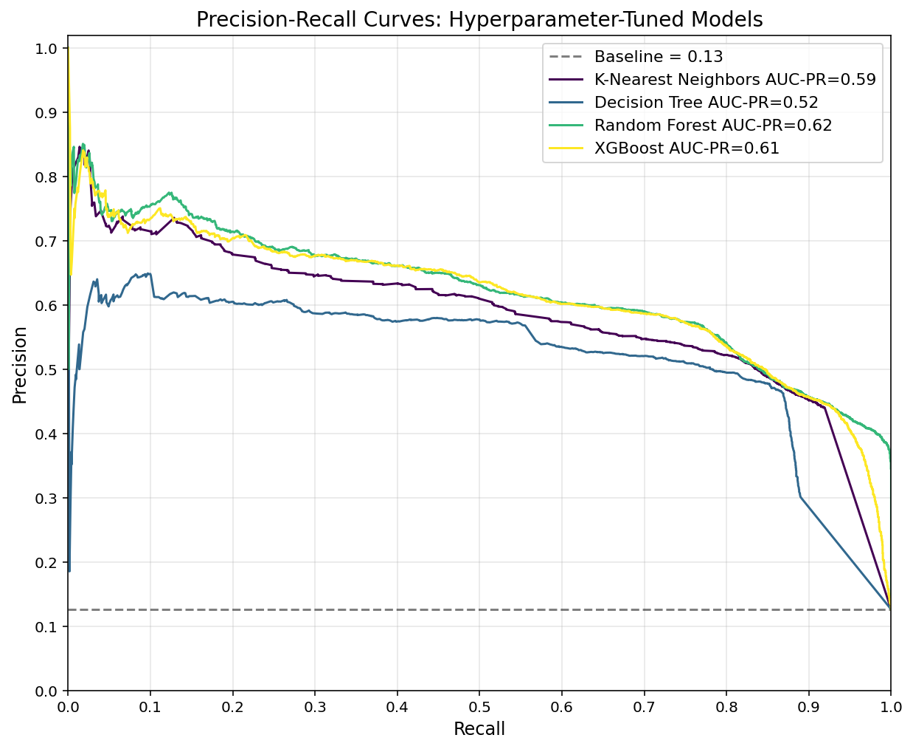
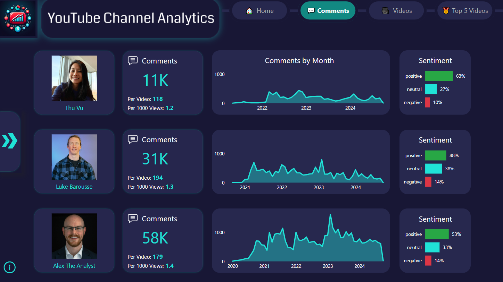
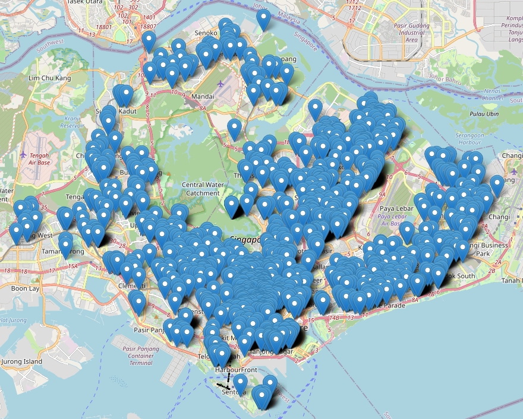
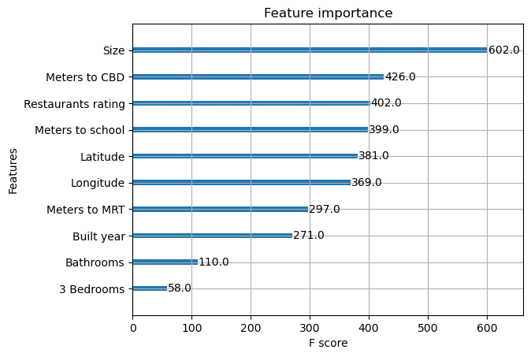
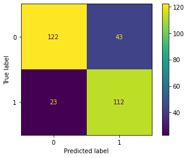
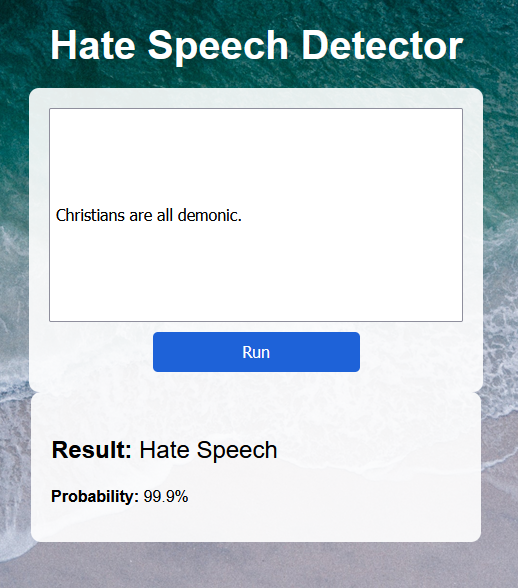

# Hi there! I'm Jens

## 👋 About Me
PhD Researcher with 8+ years in advanced statistical modeling, now applying these skills to solve Data Science problems. Expertise in end-to-end ML pipelines—from data ingestion to deployed web apps and APIs. Translating complex data into actionable insights and production-ready solutions.

## 🛠️ Skills

| Category                 | Skill    |
| ------------------------ | -------- |
| Programming              | [![Python][Python-badge]][Python-url] [![MySQL][MySQL-badge]][MySQL-url] |
| Data Manipulation        | [![NumPy][NumPy-badge]][NumPy-url] [![Pandas][Pandas-badge]][Pandas-url] |
| Data Visualization       | [![Matplotlib][Matplotlib-badge]][Matplotlib-url] [![Seaborn][Seaborn-badge]][Seaborn-url] [![Plotly][Plotly-badge]][Plotly-url] [![Power BI][PowerBI-badge]][PowerBI-url] |
| AI & Machine Learning    | [![scikit-learn][scikit-learn-badge]][scikit-learn-url] [![TensorFlow][TensorFlow-badge]][TensorFlow-url] [![Hugging Face][HuggingFace-badge]][HuggingFace-url] |
| Big Data                 | [![Spark][Spark-badge]][Spark-url] |
| Web Development          | [![FastAPI][FastAPI-badge]][FastAPI-url] [![Flask][Flask-badge]][Flask-url] [![Gradio][Gradio-badge]][Gradio-url] [![Pydantic][Pydantic-badge]][Pydantic-url] |
| Version Control          | [![Git][Git-badge]][Git-url] [![GitHub][GitHub-badge]][GitHub-url] |
| DevOps                   | [![Docker][Docker-badge]][Docker-url] [![Airflow][Airflow-badge]][Airflow-url] [![GitHub Actions][GitHubActions-badge]][GitHubActions-url] |
| Testing                  | [![pytest][Pytest-badge]][Pytest-url] [![Selenium][Selenium-badge]][Selenium-url] |
| Cloud                    | [![AWS][AWS-badge]][AWS-url] |
| Development Environments | [![Jupyter Notebook][JupyterNotebook-badge]][JupyterNotebook-url] [![VS Code][VSCode-badge]][VSCode-url] [![PyCharm][PyCharm-badge]][PyCharm-url] [![Cursor][Cursor-badge]][Cursor-url] |

## 💻 Portfolio

### [Project 1: Loan Default Prediction](https://github.com/JensBender/loan-default-prediction) 
[![Python][Python-badge]][Python-url] [![Pandas][Pandas-badge]][Pandas-url] [![scikit-learn][scikit-learn-badge]][scikit-learn-url] [![FastAPI][FastAPI-badge]][FastAPI-url] [![pytest][Pytest-badge]][Pytest-url] [![Docker][Docker-badge]][Docker-url] [![Hugging Face][HuggingFace-badge]][HuggingFace-url]    
Built an end-to-end machine learning solution for predicting loan defaults using customer application data, enabling financial institutions to make data-driven lending decisions and better manage credit risk. The project includes:
- **Data Preprocessing**: Engineered new features (e.g., job stability, city tier, state default rate), handled duplicates, data types, missing values, and outliers, scaled numerical features, and encoded categorical features.
- **Exploratory Data Analysis**: Analyzed distributions and relationships using descriptive statistics, correlations, and visualizations.
- **Modeling**: Trained and evaluated eight baseline models (e.g., Logistic Regression, Random Forest, XGBoost) and tuned hyperparameters. Selected a Random Forest Classifier with an optimized decision threshold, achieving an AUC-PR of 0.59, recall of 0.79, and precision of 0.51 for the default class on the hold-out test set. Visualized feature importances and showed model prediction examples.
- **Deployment**: Served the full machine learning pipeline (preprocessing and model) as a web app using a FastAPI backend and Gradio frontend within a single Docker container, hosted on Hugging Face Spaces. Automated deployment via GitHub Actions to sync web app files to Hugging Face Spaces on every push.
- **Testing**: Implemented comprehensive unit, integration, and end-to-end tests to validate individual components, their interactions, and entire user journeys.

**Model Pipeline:** [Hugging Face Hub](https://huggingface.co/JensBender/loan-default-prediction-pipeline)  
**Web App:** [Hugging Face Spaces](https://huggingface.co/spaces/JensBender/loan-default-prediction-app)

ℹ️ <strong>Model Performance</strong> (click to expand)

### [Project 2: ETL Pipeline for YouTube Channel Analytics](https://github.com/JensBender/youtube-channel-analytics)
[![Python][Python-badge]][Python-url] [![MySQL][MySQL-badge]][MySQL-url] [![Airflow][Airflow-badge]][Airflow-url] [![Docker][Docker-badge]][Docker-url] [![AWS][AWS-badge]][AWS-url] [![Hugging Face][HuggingFace-badge]][HuggingFace-url] [![Power BI][PowerBI-badge]][PowerBI-url]  
To empower YouTube content creators and marketers with actionable insights into their channel's performance, especially in comparison to related channels, I developed a comprehensive **ETL pipeline** and designed an interactive **Power BI report**. This project involved:

- **Data Extraction**: Utilized the YouTube API to gather extensive data from three selected channels, including videos and comments.
- **Data Transformation**: Performed sentiment analysis on video comments via API requests to a RoBERTa sentiment analysis model, which I deployed using Gradio on a private Hugging Face Space.
- **Data Loading**: Stored the transformed data in a MySQL database hosted on AWS.
- **Automation**: Managed the ETL workflow using Apache Airflow, Docker, and AWS.
- **Data Visualization**: Designed an interactive Power BI report to deliver insigths into channel performance, featuring key metrics and comparative analysis. 

This project enables YouTube content creators to easily monitor and evaluate their channel's performance relative to their peers, allowing for more informed decision-making and strategic planning.

### [Project 3: Rental Price Prediction](https://github.com/JensBender/rental-price-prediction)
[![Python][Python-badge]][Python-url] [![NumPy][NumPy-badge]][NumPy-url] [![Pandas][Pandas-badge]][Pandas-url] [![Matplotlib][Matplotlib-badge]][Matplotlib-url] [![scikit-learn][scikit-learn-badge]][scikit-learn-url] [![Flask][Flask-badge]][Flask-url] [![Docker][Docker-badge]][Docker-url]  
- **Motivation**: Simplify the process of finding rental properties in Singapore's expensive real estate market by using machine learning to estimate rental prices. 
- **Data Collection**: Scraped 1680 property listings from an online property portal, including information on price, size, address, bedrooms, bathrooms and more.
- **Exploratory Data Analysis**: Visualized property locations on an interactive map, generated a word cloud to extract insights from property agent descriptions, and examined descriptive statistics, distributions, and correlations.  
- **Data Preprocessing**: Handled missing address data and engineered location-related features using the Google Maps API, extracted property features from agent descriptions and systematically evaluated multiple outlier handling methods. 
- **Model Training**: Trained five machine learning models with baseline configurations, selected an XGBoost regression model with optimized hyperparameters, and achieved a test dataset performance with an RMSE of 995, a MAPE of 0.13, and an R² of 0.90.
- **Model Deployment**: Created a web application for serving the XGBoost model using the Flask framework. Containerized this application using Docker and successfully deployed the Docker container on render.com.

   
  

### [Project 4: Hate Speech Detection](https://github.com/JensBender/hate-speech-detection)
[![Python][Python-badge]][Python-url] [![TensorFlow][TensorFlow-badge]][TensorFlow-url] [![scikit-learn][scikit-learn-badge]][scikit-learn-url] [![NumPy][NumPy-badge]][NumPy-url] [![Pandas][Pandas-badge]][Pandas-url] [![Matplotlib][Matplotlib-badge]][Matplotlib-url] [![Flask][Flask-badge]][Flask-url]  
- **Motivation**: Develop a hate speech detector for social media comments. 
- **Data**: Utilized the [ETHOS Hate Speech Detection Dataset](https://github.com/intelligence-csd-auth-gr/Ethos-Hate-Speech-Dataset).
- **Models**: Trained and evaluated the performance of three deep learning models using TensorFlow and scikit-learn. The fine-tuned BERT model demonstrated superior performance (78.0% accuracy) compared to the SimpleRNN (66.3%) and LSTM (70.7%) models.  
- **Deployment**: Prepared the fine-tuned BERT model for production by integrating it into a web application and an API endpoint using the Flask web framework.

| Fine-tuned BERT: Confusion Matrix | Model Deployment | 
| ------------------ | ------------------ | 
|  |  |

## 🏅 Certifications & Courses

**Advanced SQL: MySQL for Ecommerce & Web Analytics** | Udemy, February 2024 | [🔗 Certificate](https://www.udemy.com/certificate/UC-ac04dd78-4589-4b2e-a863-7722cd78ec2f/)  
Skills: MySQL · Business Intelligence · Data Analysis · Subqueries · Temporary Tables

**AWS Certified Cloud Practitioner** | AWS, January 2024 | [🔗 Certificate](https://www.credly.com/badges/3287f8a9-0dcd-48d2-afc3-c255faf027bc/public_url)  
Skills: Amazon Web Services (AWS) · Cloud Concepts · Security & Compliance · Billing & Pricing

**Ultimate AWS Certified Cloud Practitioner CLF-C02** | Udemy, January 2024 | [🔗 Certificate](https://www.udemy.com/certificate/UC-2090637d-9845-42f3-9f7b-97195874331a/)  
Skills: Amazon Web Services (AWS) · Identity and Access Management (IAM) · Elastic Compute Cloud (EC2) · Simple Storage Service (S3) · Virtual Private Cloud (VPC) · CloudWatch · Database & Analytics

**Spark and Python for Big Data with PySpark** | Udemy, January 2024 | [🔗 Certificate](https://www.udemy.com/certificate/UC-27da6f52-bc5f-4e72-bc5b-c2cd488566b0/)  
Skills: Apache Spark · PySpark · Spark DataFrames · MLlib · Amazon Web Services (AWS) · Databricks

**Microsoft Power BI Data Analyst** | Udemy, November 2023 | [🔗 Certificate](https://www.udemy.com/certificate/UC-eb56c820-8c91-4e03-8c57-efdc8c570c6b/)  
Skills: Power BI · Power Query · Data Analysis Expressions (DAX) · Data Modeling · Interactive Dashboards

**Deep Learning** | alfatraining Bildungszentrum GmbH, April 2023  
Skills: TensorFlow · Neural Networks · Convolutional Neural Networks (CNN) · Computer Vision · Recurrent Neural Networks (RNN) · Long Short-Term Memory (LSTM) · Natural Language Processing (NLP) · Time Series Analysis

**Machine Learning by Stanford University & DeepLearning.AI** | Coursera, April 2023 | [🔗 Certificate](https://coursera.org/share/1c62950a6100b0426d454b652e77498c)  
Skills: Linear & Logistic Regression · Neural Networks · Recommender Systems · Reinforcement Learning

**Python for Machine Learning & Data Science Masterclass** | Udemy, March 2023 | [🔗 Certificate](https://www.udemy.com/certificate/UC-4de79ac0-2282-45c9-93e1-a7cb6f812592/)  
Skills: scikit-learn · Pandas · NumPy · Matplotlib · Seaborn · Random Forest · Gradient Boosting · Support Vector Machines (SVM) · DBSCAN

**Machine Learning** | alfatraining Bildungszentrum GmbH, February 2023  
Skills: Regression · K-Nearest Neighbors (KNN) · Decision Trees · Random Forest · Support Vector Machines (SVM) · Clustering · Principal Component Analysis (PCA) · Feature Engineering · Model Evaluation

**The Ultimate MySQL Bootcamp: Go from SQL Beginner to Expert** | Udemy, December 2022 | [🔗 Certificate](https://www.udemy.com/certificate/UC-e324e4f7-95ba-4894-b8e0-65229ff5e2dc)  
Skills: MySQL · Database Schemas · SQL Joins · Aggregate Functions · Window Functions

## 👨‍💻 GitHub Statistics

  

## ©️ Credits
<small>Profile banner GIF based on the video by [RDNE Stock project](https://www.pexels.com/video/business-analytics-presentation-7947451/) from Pexels</small>

<!-- MARKDOWN LINKS -->
[Airflow-badge]: https://img.shields.io/badge/Apache%20Airflow-017CEE?style=for-the-badge&logo=Apache%20Airflow&logoColor=white
[Airflow-url]: https://airflow.apache.org/
[AWS-badge]: https://img.shields.io/badge/AWS-%23FF9900?style=for-the-badge&logo=amazonaws&logoColor=white
[AWS-url]: https://aws.amazon.com/
[ChatGPT-badge]: https://img.shields.io/badge/chatGPT-74aa9c?style=for-the-badge&logo=openai&logoColor=white
[ChatGPT-url]: https://chatgpt.com/
[Cursor-badge]: https://img.shields.io/badge/Cursor-000000?style=for-the-badge&logo=data:image/svg+xml;base64,PHN2ZyB4bWxucz0iaHR0cDovL3d3dy53My5vcmcvMjAwMC9zdmciICB2aWV3Qm94PSIwIDAgNDggNDgiIHdpZHRoPSI0OHB4IiBoZWlnaHQ9IjQ4cHgiIGZpbGwtcnVsZT0iZXZlbm9kZCIgY2xpcC1ydWxlPSJldmVub2RkIiBiYXNlUHJvZmlsZT0iYmFzaWMiPjxwb2x5Z29uIGZpbGw9IiNiY2JjYmMiIHBvaW50cz0iMjMuOTc0LDQgNi45NywxNCA2Ljk3LDM0IDIzLjk5OCw0NCA0MC45NywzNCA0MC45NywxNCIvPjxsaW5lIHgxPSI3Ljk3IiB4Mj0iMjMuNTc5IiB5MT0iMzMiIHkyPSIyNC40NTQiIGZpbGw9Im5vbmUiIHN0cm9rZT0iI2JjYmNiYyIgc3Ryb2tlLWxpbmVjYXA9InJvdW5kIiBzdHJva2UtbGluZWpvaW49InJvdW5kIiBzdHJva2UtbWl0ZXJsaW1pdD0iMTAiIHN0cm9rZS13aWR0aD0iMiIvPjxsaW5lIHgxPSIyMy45NzIiIHgyPSIyMy45NjYiIHkxPSI1LjkwMyIgeTI9IjE1Ljg2NCIgZmlsbD0ibm9uZSIgc3Ryb2tlPSIjYmNiY2JjIiBzdHJva2UtbGluZWNhcD0icm91bmQiIHN0cm9rZS1saW5lam9pbj0icm91bmQiIHN0cm9rZS1taXRlcmxpbWl0PSIxMCIgc3Ryb2tlLXdpZHRoPSIyIi8+PGxpbmUgeDE9IjM5Ljk3IiB4Mj0iMzIuOTciIHkxPSIzMyIgeTI9IjI5IiBmaWxsPSJub25lIiBzdHJva2U9IiNiY2JjYmMiIHN0cm9rZS1saW5lY2FwPSJyb3VuZCIgc3Ryb2tlLWxpbmVqb2luPSJyb3VuZCIgc3Ryb2tlLW1pdGVybGltaXQ9IjEwIiBzdHJva2Utd2lkdGg9IjIiLz48cG9seWdvbiBmaWxsPSIjNzU3NTc1IiBwb2ludHM9IjIzLjk3NCw0IDYuOTcsMTQgNi45NywzNCAyMy45NywyNCIvPjxwb2x5Z29uIGZpbGw9IiM0MjQyNDIiIHBvaW50cz0iMjMuOTgxLDE0IDQwLjk3LDE0IDQwLjk3LDM0IDIzLjk3MSwyNCIvPjxwb2x5Z29uIGZpbGw9IiM2MTYxNjEiIGZpbGwtcnVsZT0iZXZlbm9kZCIgcG9pbnRzPSI0MC45NywxNCAyMy45NjYsMTcgMjMuOTc0LDQiIGNsaXAtcnVsZT0iZXZlbm9kZCIvPjxwb2x5Z29uIGZpbGw9IiM2MTYxNjEiIGZpbGwtcnVsZT0iZXZlbm9kZCIgcG9pbnRzPSI2Ljk3LDE0IDIzLjk4MSwxNi44ODEgMjMuOTY2LDI0IDYuOTcsMzQiIGNsaXAtcnVsZT0iZXZlbm9kZCIvPjxwb2x5Z29uIGZpbGw9IiNlZGVkZWQiIHBvaW50cz0iNi45NywxNCAyMy45NywyNCAyMy45OTgsNDQgNDAuOTcsMTQiLz48L3N2Zz4=
[Cursor-url]: https://www.cursor.com/
[Docker-badge]: https://img.shields.io/badge/docker-%230db7ed.svg?style=for-the-badge&logo=docker&logoColor=white
[Docker-url]: https://www.docker.com/
[FastAPI-badge]: https://img.shields.io/badge/FastAPI-009688?style=for-the-badge&logo=fastapi&logoColor=white
[FastAPI-url]: https://fastapi.tiangolo.com/
[Flask-badge]: https://img.shields.io/badge/flask-%23000.svg?style=for-the-badge&logo=flask&logoColor=white
[Flask-url]: https://flask.palletsprojects.com/en/2.3.x/
[Git-badge]: https://img.shields.io/badge/git-%23F05033.svg?style=for-the-badge&logo=git&logoColor=white
[Git-url]: https://git-scm.com/
[GitHub-badge]: https://img.shields.io/badge/github-%23121011.svg?style=for-the-badge&logo=github&logoColor=white
[GitHub-url]: https://github.com/
[GitHubActions-badge]: https://img.shields.io/badge/github%20actions-%236E5494.svg?style=for-the-badge&logo=githubactions&logoColor=white
[GitHubActions-url]: https://github.com/features/actions
[Gradio-badge]: https://img.shields.io/badge/Gradio-fc7404?style=for-the-badge&logo=gradio&logoColor=white
[Gradio-url]: https://gradio.app
[HuggingFace-badge]: https://img.shields.io/badge/Hugging%20Face-ffcc00?style=for-the-badge&logo=huggingface&logoColor=black
[HuggingFace-url]: https://huggingface.co/
[JupyterNotebook-badge]: https://img.shields.io/badge/Jupyter-F37626.svg?style=for-the-badge&logo=Jupyter&logoColor=white
[JupyterNotebook-url]: https://jupyter.org/
[Matplotlib-badge]: https://img.shields.io/badge/Matplotlib-%23DDDDDD?style=for-the-badge&logo=data:image/svg+xml;base64,PD94bWwgdmVyc2lvbj0iMS4wIiBlbmNvZGluZz0iVVRGLTgiPz4KPHN2ZyB4bWxucz0iaHR0cDovL3d3dy53My5vcmcvMjAwMC9zdmciIHdpZHRoPSIxODAiIGhlaWdodD0iMTgwIiBzdHJva2U9ImdyYXkiPgo8ZyBzdHJva2Utd2lkdGg9IjIiIGZpbGw9IiNGRkYiPgo8Y2lyY2xlIGN4PSI5MCIgY3k9IjkwIiByPSI4OCIvPgo8Y2lyY2xlIGN4PSI5MCIgY3k9IjkwIiByPSI2NiIvPgo8Y2lyY2xlIGN4PSI5MCIgY3k9IjkwIiByPSI0NCIvPgo8Y2lyY2xlIGN4PSI5MCIgY3k9IjkwIiByPSIyMiIvPgo8cGF0aCBkPSJtOTAsMnYxNzZtNjItMjYtMTI0LTEyNG0xMjQsMC0xMjQsMTI0bTE1MC02MkgyIi8+CjwvZz48ZyBvcGFjaXR5PSIuOCI+CjxwYXRoIGZpbGw9IiM0NEMiIGQ9Im05MCw5MGgxOGExOCwxOCAwIDAsMCAwLTV6Ii8+CjxwYXRoIGZpbGw9IiNCQzMiIGQ9Im05MCw5MCAzNC00M2E1NSw1NSAwIDAsMC0xNS04eiIvPgo8cGF0aCBmaWxsPSIjRDkzIiBkPSJtOTAsOTAtMTYtNzJhNzQsNzQgMCAwLDAtMzEsMTV6Ii8+CjxwYXRoIGZpbGw9IiNEQjMiIGQ9Im05MCw5MC01OC0yOGE2NSw2NSAwIDAsMC01LDM5eiIvPgo8cGF0aCBmaWxsPSIjM0JCIiBkPSJtOTAsOTAtMzMsMTZhMzcsMzcgMCAwLDAgMiw1eiIvPgo8cGF0aCBmaWxsPSIjM0M5IiBkPSJtOTAsOTAtMTAsNDVhNDYsNDYgMCAwLDAgMTgsMHoiLz4KPHBhdGggZmlsbD0iI0Q3MyIgZD0ibTkwLDkwIDQ2LDU4YTc0LDc0IDAgMCwwIDEyLTEyeiIvPgo8L2c+PC9zdmc+
[Matplotlib-url]: https://matplotlib.org/
[MySQL-badge]: https://img.shields.io/badge/mysql-%2300f.svg?style=for-the-badge&logo=mysql&logoColor=white
[MySQL-url]: https://www.mysql.com/
[NumPy-badge]: https://img.shields.io/badge/numpy-%23013243.svg?style=for-the-badge&logo=numpy&logoColor=white
[NumPy-url]: https://numpy.org/
[Pandas-badge]: https://img.shields.io/badge/pandas-%23150458.svg?style=for-the-badge&logo=pandas&logoColor=white
[Pandas-url]: https://pandas.pydata.org/
[PowerBI-badge]: https://img.shields.io/badge/power_bi-F2C811?style=for-the-badge&logo=data:image/svg+xml;base64,PD94bWwgdmVyc2lvbj0iMS4wIiBlbmNvZGluZz0iVVRGLTgiPz4KPHN2ZyB3aWR0aD0iNjMwcHgiIGhlaWdodD0iNjMwcHgiIHZpZXdCb3g9IjAgMCA2MzAgNjMwIiB2ZXJzaW9uPSIxLjEiIHhtbG5zPSJodHRwOi8vd3d3LnczLm9yZy8yMDAwL3N2ZyIgeG1sbnM6eGxpbms9Imh0dHA6Ly93d3cudzMub3JnLzE5OTkveGxpbmsiPgogICAgPCEtLSBHZW5lcmF0b3I6IFNrZXRjaCA1My4yICg3MjY0MykgLSBodHRwczovL3NrZXRjaGFwcC5jb20gLS0+CiAgICA8dGl0bGU+UEJJIExvZ288L3RpdGxlPgogICAgPGRlc2M+Q3JlYXRlZCB3aXRoIFNrZXRjaC48L2Rlc2M+CiAgICA8ZGVmcz4KICAgICAgICA8bGluZWFyR3JhZGllbnQgeDE9IjUwJSIgeTE9IjAlIiB4Mj0iNTAlIiB5Mj0iMTAwJSIgaWQ9ImxpbmVhckdyYWRpZW50LTEiPgogICAgICAgICAgICA8c3RvcCBzdG9wLWNvbG9yPSIjRUJCQjE0IiBvZmZzZXQ9IjAlIj48L3N0b3A+CiAgICAgICAgICAgIDxzdG9wIHN0b3AtY29sb3I9IiNCMjU0MDAiIG9mZnNldD0iMTAwJSI+PC9zdG9wPgogICAgICAgIDwvbGluZWFyR3JhZGllbnQ+CiAgICAgICAgPGxpbmVhckdyYWRpZW50IHgxPSI1MCUiIHkxPSIwJSIgeDI9IjUwJSIgeTI9IjEwMCUiIGlkPSJsaW5lYXJHcmFkaWVudC0yIj4KICAgICAgICAgICAgPHN0b3Agc3RvcC1jb2xvcj0iI0Y5RTU4MyIgb2Zmc2V0PSIwJSI+PC9zdG9wPgogICAgICAgICAgICA8c3RvcCBzdG9wLWNvbG9yPSIjREU5ODAwIiBvZmZzZXQ9IjEwMCUiPjwvc3RvcD4KICAgICAgICA8L2xpbmVhckdyYWRpZW50PgogICAgICAgIDxwYXRoIGQ9Ik0zNDYsNjA0IEwzNDYsNjMwIEwzMjAsNjMwIEwxNTMsNjMwIEMxMzguNjQwNTk3LDYzMCAxMjcsNjE4LjM1OTQwMyAxMjcsNjA0IEwxMjcsMTgzIEMxMjcsMTY4LjY0MDU5NyAxMzguNjQwNTk3LDE1NyAxNTMsMTU3IEwzMjAsMTU3IEMzMzQuMzU5NDAzLDE1NyAzNDYsMTY4LjY0MDU5NyAzNDYsMTgzIEwzNDYsNjA0IFoiIGlkPSJwYXRoLTMiPjwvcGF0aD4KICAgICAgICA8ZmlsdGVyIHg9Ii05LjElIiB5PSItNi4zJSIgd2lkdGg9IjEzNi41JSIgaGVpZ2h0PSIxMTYuOSUiIGZpbHRlclVuaXRzPSJvYmplY3RCb3VuZGluZ0JveCIgaWQ9ImZpbHRlci00Ij4KICAgICAgICAgICAgPGZlT2Zmc2V0IGR4PSIyMCIgZHk9IjEwIiBpbj0iU291cmNlQWxwaGEiIHJlc3VsdD0ic2hhZG93T2Zmc2V0T3V0ZXIxIj48L2ZlT2Zmc2V0PgogICAgICAgICAgICA8ZmVHYXVzc2lhbkJsdXIgc3RkRGV2aWF0aW9uPSIxMCIgaW49InNoYWRvd09mZnNldE91dGVyMSIgcmVzdWx0PSJzaGFkb3dCbHVyT3V0ZXIxIj48L2ZlR2F1c3NpYW5CbHVyPgogICAgICAgICAgICA8ZmVDb2xvck1hdHJpeCB2YWx1ZXM9IjAgMCAwIDAgMCAgIDAgMCAwIDAgMCAgIDAgMCAwIDAgMCAgMCAwIDAgMC4wNTMwMjExOTc2IDAiIHR5cGU9Im1hdHJpeCIgaW49InNoYWRvd0JsdXJPdXRlcjEiPjwvZmVDb2xvck1hdHJpeD4KICAgICAgICA8L2ZpbHRlcj4KICAgICAgICA8bGluZWFyR3JhZGllbnQgeDE9IjUwJSIgeTE9IjAlIiB4Mj0iNTAlIiB5Mj0iMTAwJSIgaWQ9ImxpbmVhckdyYWRpZW50LTUiPgogICAgICAgICAgICA8c3RvcCBzdG9wLWNvbG9yPSIjRjlFNjhCIiBvZmZzZXQ9IjAlIj48L3N0b3A+CiAgICAgICAgICAgIDxzdG9wIHN0b3AtY29sb3I9IiNGM0NEMzIiIG9mZnNldD0iMTAwJSI+PC9zdG9wPgogICAgICAgIDwvbGluZWFyR3JhZGllbnQ+CiAgICA8L2RlZnM+CiAgICA8ZyBpZD0iUEJJLUxvZ28iIHN0cm9rZT0ibm9uZSIgc3Ryb2tlLXdpZHRoPSIxIiBmaWxsPSJub25lIiBmaWxsLXJ1bGU9ImV2ZW5vZGQiPgogICAgICAgIDxnIGlkPSJHcm91cCIgdHJhbnNmb3JtPSJ0cmFuc2xhdGUoNzcuNTAwMDAwLCAwLjAwMDAwMCkiPgogICAgICAgICAgICA8cmVjdCBpZD0iUmVjdGFuZ2xlIiBmaWxsPSJ1cmwoI2xpbmVhckdyYWRpZW50LTEpIiB4PSIyNTYiIHk9IjAiIHdpZHRoPSIyMTkiIGhlaWdodD0iNjMwIiByeD0iMjYiPjwvcmVjdD4KICAgICAgICAgICAgPGcgaWQ9IkNvbWJpbmVkLVNoYXBlIj4KICAgICAgICAgICAgICAgIDx1c2UgZmlsbD0iYmxhY2siIGZpbGwtb3BhY2l0eT0iMSIgZmlsdGVyPSJ1cmwoI2ZpbHRlci00KSIgeGxpbms6aHJlZj0iI3BhdGgtMyI+PC91c2U+CiAgICAgICAgICAgICAgICA8dXNlIGZpbGw9InVybCgjbGluZWFyR3JhZGllbnQtMikiIGZpbGwtcnVsZT0iZXZlbm9kZCIgeGxpbms6aHJlZj0iI3BhdGgtMyI+PC91c2U+CiAgICAgICAgICAgIDwvZz4KICAgICAgICAgICAgPHBhdGggZD0iTTIxOSw2MDQgTDIxOSw2MzAgTDE5Myw2MzAgTDI2LDYzMCBDMTEuNjQwNTk2NSw2MzAgMS43NTg1MTk3NWUtMTUsNjE4LjM1OTQwMyAwLDYwNCBMMCwzNDEgQy0xLjc1ODUxOTc1ZS0xNSwzMjYuNjQwNTk3IDExLjY0MDU5NjUsMzE1IDI2LDMxNSBMMTkzLDMxNSBDMjA3LjM1OTQwMywzMTUgMjE5LDMyNi42NDA1OTcgMjE5LDM0MSBMMjE5LDYwNCBaIiBpZD0iQ29tYmluZWQtU2hhcGUiIGZpbGw9InVybCgjbGluZWFyR3JhZGllbnQtNSkiPjwvcGF0aD4KICAgICAgICA8L2c+CiAgICA8L2c+Cjwvc3ZnPg==
[PowerBI-url]: https://powerbi.microsoft.com/en-us/
[Plotly-badge]: https://img.shields.io/badge/Plotly-%233F4F75.svg?style=for-the-badge&logo=plotly&logoColor=white
[Plotly-url]: https://plotly.com/python/
[PyCharm-badge]: https://img.shields.io/badge/pycharm-143?style=for-the-badge&logo=pycharm&logoColor=black&color=black&labelColor=green
[PyCharm-url]: https://www.jetbrains.com/pycharm/
[Pydantic-badge]: https://img.shields.io/badge/Pydantic-3776AB?style=for-the-badge&logo=pydantic&logoColor=white
[Pydantic-url]: https://docs.pydantic.dev/
[Python-badge]: https://img.shields.io/badge/python-3670A0?style=for-the-badge&logo=python&logoColor=ffdd54
[Pytest-badge]: https://img.shields.io/badge/pytest-%23F0F0F0?style=for-the-badge&logo=pytest&logoColor=2f9fe3
[Pytest-url]: https://docs.pytest.org/
[Python-url]: https://www.python.org/
[scikit-learn-badge]: https://img.shields.io/badge/scikit--learn-%23F7931E.svg?style=for-the-badge&logo=scikit-learn&logoColor=white
[scikit-learn-url]: https://scikit-learn.org/stable/
[Seaborn-badge]: https://img.shields.io/badge/seaborn-%230C4A89.svg?style=for-the-badge&logo=seaborn&logoColor=white
[Seaborn-url]: https://seaborn.pydata.org/
[Selenium-badge]: https://img.shields.io/badge/selenium-%43B02A.svg?style=for-the-badge&logo=selenium&logoColor=white
[Selenium-url]: https://www.selenium.dev/
[Spark-badge]: https://img.shields.io/badge/Apache%20Spark-E25A1C.svg?style=for-the-badge&logo=Apache-Spark&logoColor=white
[Spark-url]: https://spark.apache.org/
[TensorFlow-badge]: https://img.shields.io/badge/TensorFlow-%23FF6F00.svg?style=for-the-badge&logo=TensorFlow&logoColor=white
[TensorFlow-url]: https://www.tensorflow.org/
[VSCode-badge]: https://img.shields.io/badge/VS%20Code-0078D4?style=for-the-badge&logo=visualstudiocode&logoColor=white
[VSCode-url]: https://code.visualstudio.com/
