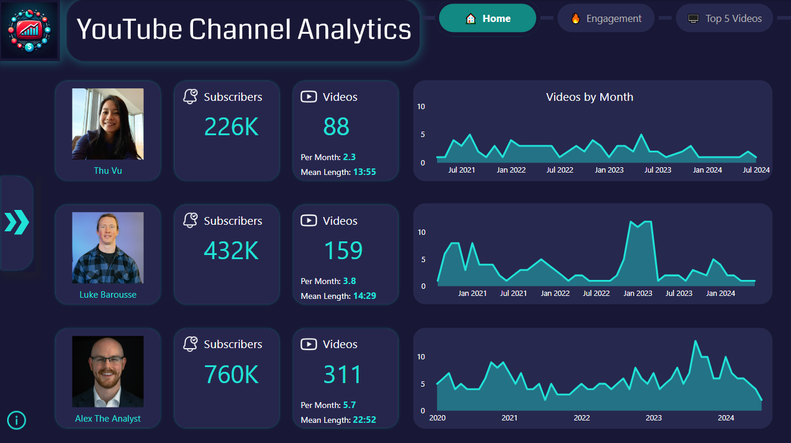
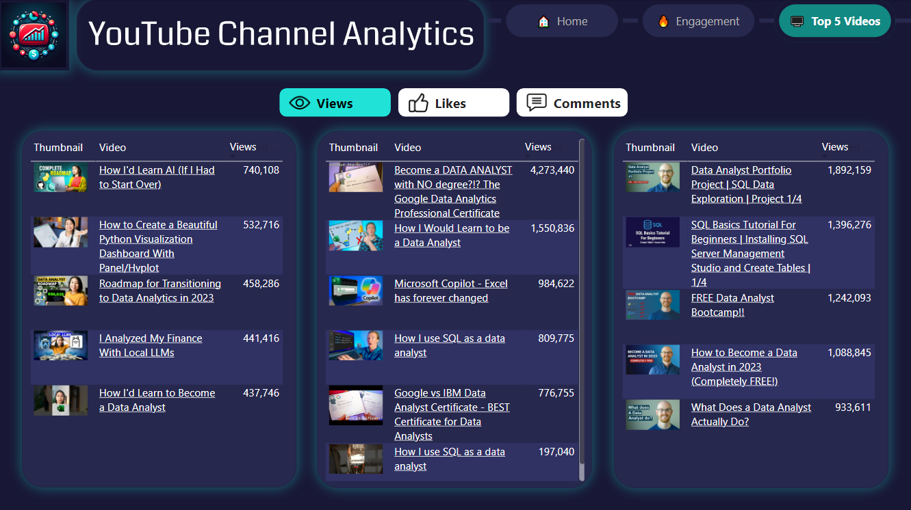

# Hi there! I'm Jens

<!-- ABOUT ME -->
## 👋 About Me
I'm an enthusiastic **data scientist** with over eight years of experience in data analysis, data visualization, and data storytelling. I enjoy solving challenging problems, harnessing the power of machine learning to derive valuable insights, and effectively communicating complex information.

<!-- SKILLS -->
## 🛠️ Skills

| Category                 | Skill    |
| ------------------------ | -------- |
| Programming              | [![Python][Python-badge]][Python-url] [![MySQL][MySQL-badge]][MySQL-url] |
| Data Manipulation        | [![NumPy][NumPy-badge]][NumPy-url] [![Pandas][Pandas-badge]][Pandas-url] |
| Data Visualization       | [![Matplotlib][Matplotlib-badge]][Matplotlib-url] [![Plotly][Plotly-badge]][Plotly-url] [![Power BI][PowerBI-badge]][PowerBI-url] |
| Machine Learning         | [![scikit-learn][scikit-learn-badge]][scikit-learn-url] [![TensorFlow][TensorFlow-badge]][TensorFlow-url] |
| Big Data                 | [![Spark][Spark-badge]][Spark-url] |
| Cloud                    | [![AWS][AWS-badge]][AWS-url] |
| DevOps                   | [![Docker][Docker-badge]][Docker-url] [![Airflow][Airflow-badge]][Airflow-url] |
| Version Control          | [![Git][Git-badge]][Git-url] [![GitHub][GitHub-badge]][GitHub-url] |
| Web Development          | [![Flask][Flask-badge]][Flask-url] |
| Development Environments | [![Jupyter Notebook][JupyterNotebook-badge]][JupyterNotebook-url] [![PyCharm][PyCharm-badge]][PyCharm-url] [![Spyder][Spyder-badge]][Spyder-url] |

<!-- PORTFOLIO -->
## 💻 Portfolio

### [Project 1: YouTube Channel Analytics](https://github.com/JensBender/youtube-channel-analytics)
To empower YouTube content creators and marketers with actionable insights into their channels' performance, especially in comparison to related channels, I developed an **ETL pipeline**. This involved:

+ **Data Extraction**: Utilized the YouTube API to gather extensive data from three selected channels, including videos and comments.
+ **Data Transformation**: Employed Pandas to clean and process the extracted data for analysis.
+ **Data Loading**: Stored the transformed data in a MySQL database hosted on AWS.
+ **Automation**: Managed the ETL workflow using Apache Airflow, Docker, and AWS.
+ **Data Visualization**: Designed an interactive PowerBI report to deliver insigths into channel performance, featuring key metrics and comparative analysis. 

This project enables YouTube content creators to easily monitor and evaluate their channel's performance relative to their peers, allowing for more informed decision-making and strategic planning.

   
  

### [Project 2: Rental Price Prediction](https://github.com/JensBender/rental-price-prediction)
+ **Motivation**: Simplify the process of finding rental properties in Singapore's expensive real estate market by using machine learning to estimate rental prices. 
+ **Data collection**: Scraped 1680 property listings from an online property portal, including information on price, size, address, bedrooms, bathrooms and more.
+ **Exploratory data analysis**: Visualized property locations on an interactive map, generated a word cloud to extract insights from property agent descriptions, and examined descriptive statistics, distributions, and correlations.  
+ **Data preprocessing**: Handled missing address data and engineered location-related features using the Google Maps API, extracted property features from agent descriptions and systematically evaluated multiple outlier handling methods. 
+ **Model training**: Trained five machine learning models with baseline configurations, selected an XGBoost regression model with optimized hyperparameters, and achieved a test dataset performance with an RMSE of 995, a MAPE of 0.13, and an R² of 0.90.
+ **Model deployment**: Created a web application for serving the XGBoost model using the Flask framework. Containerized this application using Docker and successfully deployed the Docker container on render.com.

   
  

### [Project 3: Hate Speech Detection](https://github.com/JensBender/hate-speech-detection)
+ **Motivation**: Develop a hate speech detector for social media comments. 
+ **Data**: Utilized the [ETHOS Hate Speech Detection Dataset](https://github.com/intelligence-csd-auth-gr/Ethos-Hate-Speech-Dataset).
+ **Models**: Trained and evaluated the performance of three deep learning models using TensorFlow and scikit-learn. The fine-tuned BERT model demonstrated superior performance (78.0% accuracy) compared to the SimpleRNN (66.3%) and LSTM (70.7%) models.  
+ **Deployment**: Prepared the fine-tuned BERT model for production by integrating it into a web application and an API endpoint using the Flask web framework.

| Fine-tuned BERT: Confusion Matrix | Model Deployment | 
| ------------------ | ------------------ | 
|  |  |

<!-- COURSE CERTIFICATES -->
## 🏅 Course Certificates

**Advanced SQL: MySQL for Ecommerce & Web Analytics**, Udemy, February 2024, [🔗 see certificate](https://www.udemy.com/certificate/UC-ac04dd78-4589-4b2e-a863-7722cd78ec2f/)  
Skills: MySQL · SQL

**AWS Certified Cloud Practitioner**, AWS, January 2024, [🔗 see certificate](https://www.credly.com/badges/3287f8a9-0dcd-48d2-afc3-c255faf027bc/public_url)  
Skills: Amazon Web Services (AWS) 

**Ultimate AWS Certified Cloud Practitioner CLF-C02**, Udemy, January 2024, [🔗 see certificate](https://www.udemy.com/certificate/UC-2090637d-9845-42f3-9f7b-97195874331a/)  
Skills: Amazon Web Services (AWS) 

**Spark and Python for Big Data with PySpark**, Udemy, January 2024, [🔗 see certificate](https://www.udemy.com/certificate/UC-27da6f52-bc5f-4e72-bc5b-c2cd488566b0/)  
Skills: Spark · PySpark · AWS · Python · Machine Learning · Linear Regression · Logistic Regression · Decision Trees · Random Forest · Gradient Boosting · k-means clustering · Recommender Systems · Natural Language Processing (NLP) 

**Microsoft Power BI Data Analyst**, Udemy, November 2023, [🔗 see certificate](https://www.udemy.com/certificate/UC-eb56c820-8c91-4e03-8c57-efdc8c570c6b/)  
Skills: Power BI

**Deep Learning**, alfatraining Bildungszentrum GmbH, April 2023  
Skills: TensorFlow · NumPy · Natural Language Processing (NLP) · Python · Deep Learning · Recurrent Neural Networks (RNN) · Neural Networks · Scikit-Learn · Reinforcement Learning · Transfer Learning · Convolutional Neural Networks (CNN) · Time Series Analysis

**Machine Learning by Stanford University & DeepLearning.AI**, Coursera, April 2023, [🔗 see certificate](https://coursera.org/share/1c62950a6100b0426d454b652e77498c)  
Skills: Decision Trees · Recommender Systems · Anomaly Detection · Python · Linear Regression · Neural Networks · Logistic Regression · Reinforcement Learning · Principal Component Analysis · k-means clustering

**Python for Machine Learning & Data Science Masterclass**, Udemy, March 2023, [🔗 see certificate](https://www.udemy.com/certificate/UC-4de79ac0-2282-45c9-93e1-a7cb6f812592/)  
Skills: Decision Trees · Support Vector Machine (SVM) · Matplotlib · Random Forest · Naive Bayes · NumPy · Seaborn · Hierarchical Clustering · Natural Language Processing (NLP) · Pandas · Python · Linear Regression · Scikit-Learn · Logistic Regression · Principal Component Analysis · Gradient Boosting · DBSCAN · k-means clustering · K-Nearest Neighbors (KNN)

**Machine Learning**, alfatraining Bildungszentrum GmbH, February 2023  
Skills: Decision Trees · Support Vector Machine (SVM) · Matplotlib · Naive Bayes · NumPy · Hierarchical Clustering · Pandas · Python · Linear Regression · Neural Networks · Scikit-Learn · Principal Component Analysis · DBSCAN · k-means clustering · K-Nearest Neighbors (KNN)

**The Ultimate MySQL Bootcamp: Go from SQL Beginner to Expert**, Udemy, December 2022, [🔗 see certificate](https://www.udemy.com/certificate/UC-e324e4f7-95ba-4894-b8e0-65229ff5e2dc)  
Skills: MySQL · SQL

<!-- GITHUB STATISTICS -->
## 👨‍💻 GitHub Statistics

<!-- CREDITS -->
## ©️ Credits
<small>Profile banner GIF based on the video by [RDNE Stock project](https://www.pexels.com/video/business-analytics-presentation-7947451/) from Pexels</small>

<!-- MARKDOWN LINKS -->
[Airflow-badge]: https://img.shields.io/badge/Apache%20Airflow-017CEE?style=for-the-badge&logo=Apache%20Airflow&logoColor=white
[Airflow-url]: https://airflow.apache.org/
[AWS-badge]: https://img.shields.io/badge/AWS-%23FF9900.svg?style=for-the-badge&logo=amazon-aws&logoColor=white
[AWS-url]: https://aws.amazon.com/
[Docker-badge]: https://img.shields.io/badge/docker-%230db7ed.svg?style=for-the-badge&logo=docker&logoColor=white
[Docker-url]: https://www.docker.com/
[Flask-badge]: https://img.shields.io/badge/flask-%23000.svg?style=for-the-badge&logo=flask&logoColor=white
[Flask-url]: https://flask.palletsprojects.com/en/2.3.x/
[Git-badge]: https://img.shields.io/badge/git-%23F05033.svg?style=for-the-badge&logo=git&logoColor=white
[Git-url]: https://git-scm.com/
[GitHub-badge]: https://img.shields.io/badge/github-%23121011.svg?style=for-the-badge&logo=github&logoColor=white
[GitHub-url]: https://github.com/
[JupyterNotebook-badge]: https://img.shields.io/badge/Jupyter-F37626.svg?style=for-the-badge&logo=Jupyter&logoColor=white
[JupyterNotebook-url]: https://jupyter.org/
[Matplotlib-badge]: https://img.shields.io/badge/Matplotlib-%23ffffff.svg?style=for-the-badge&logo=Matplotlib&logoColor=black
[Matplotlib-url]: https://matplotlib.org/
[MySQL-badge]: https://img.shields.io/badge/mysql-%2300f.svg?style=for-the-badge&logo=mysql&logoColor=white
[MySQL-url]: https://www.mysql.com/
[NumPy-badge]: https://img.shields.io/badge/numpy-%23013243.svg?style=for-the-badge&logo=numpy&logoColor=white
[NumPy-url]: https://numpy.org/
[Pandas-badge]: https://img.shields.io/badge/pandas-%23150458.svg?style=for-the-badge&logo=pandas&logoColor=white
[Pandas-url]: https://pandas.pydata.org/
[PowerBI-badge]: https://img.shields.io/badge/power_bi-F2C811?style=for-the-badge&logo=powerbi&logoColor=black
[PowerBI-url]: https://powerbi.microsoft.com/en-us/
[Plotly-badge]: https://img.shields.io/badge/Plotly-%233F4F75.svg?style=for-the-badge&logo=plotly&logoColor=white
[Plotly-url]: https://plotly.com/python/
[PyCharm-badge]: https://img.shields.io/badge/pycharm-143?style=for-the-badge&logo=pycharm&logoColor=black&color=black&labelColor=green
[PyCharm-url]: https://www.jetbrains.com/pycharm/
[Python-badge]: https://img.shields.io/badge/python-3670A0?style=for-the-badge&logo=python&logoColor=ffdd54
[Python-url]: https://www.python.org/
[scikit-learn-badge]: https://img.shields.io/badge/scikit--learn-%23F7931E.svg?style=for-the-badge&logo=scikit-learn&logoColor=white
[scikit-learn-url]: https://scikit-learn.org/stable/
[Spark-badge]: https://img.shields.io/badge/Apache%20Spark-E25A1C.svg?style=for-the-badge&logo=Apache-Spark&logoColor=white
[Spark-url]: https://spark.apache.org/
[Spyder-badge]: https://img.shields.io/badge/Spyder-838485?style=for-the-badge&logo=spyder%20ide&logoColor=maroon
[Spyder-url]: https://www.spyder-ide.org/
[TensorFlow-badge]: https://img.shields.io/badge/TensorFlow-%23FF6F00.svg?style=for-the-badge&logo=TensorFlow&logoColor=white
[TensorFlow-url]: https://www.tensorflow.org/
